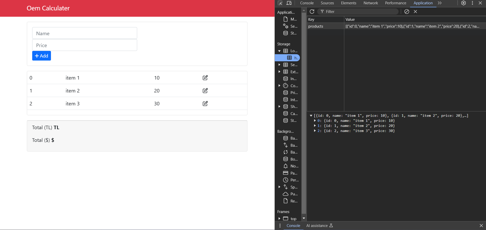
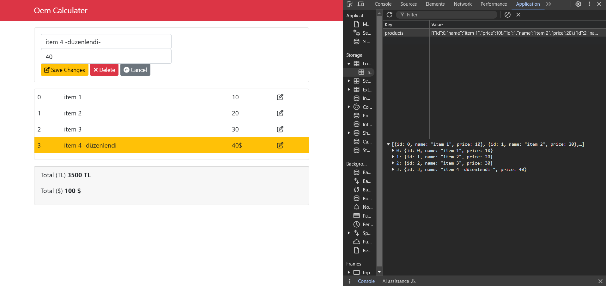

# OEM Calculator

Kullanıcıların OEM hesaplamalarını hızlı ve doğru bir şekilde yapmalarını sağlayan basit bir uygulama.

## 📌 Proje Konusu

Bu proje, kullanıcıların **OEM parametrelerini** girmelerine ve anında doğru hesaplamalar yapmalarına imkan tanır. Kullanıcılar belirli değerleri girerek hesaplamalar gerçekleştirebilir ve sonuçları anında görebilirler.

## 🎯 Neden Geliştirildi?

Bu projeyi geliştirme motivasyonum:  
✅ **Matematiksel hesaplamalar** ve kullanıcı etkileşimi ile ilgili deneyim kazanmak  
✅ **JavaScript ile hesaplama fonksiyonları** kullanarak veri işleme pratiği yapmak  
✅ **Basit ve kullanımı kolay bir kullanıcı arayüzü** tasarlamak  
✅ **Local Storage** ile verileri kaydedip geri getirme deneyimi kazanmak

## 🚀 Ne Öğrendim?

Bu projeyi geliştirirken aşağıdaki konularda bilgi ve deneyim kazandım:

- **JavaScript hesaplama fonksiyonları** ile temel işlemleri gerçekleştirme  
- **HTML ve CSS kullanımı** ile sade ve kullanıcı dostu arayüz tasarlama  
- **DOM Manipülasyonu** ile kullanıcıdan giriş alma ve çıktıyı ekrana yazdırma  
- **Event Handling** ile kullanıcı etkileşimi oluşturma  
- **Local Storage kullanımı** ile kullanıcı verilerini kaydetme ve geri yükleme  

## 🔥 Özellikler

✅ **OEM parametre hesaplamaları**: Kullanıcılar, belirlenen değerleri girerek doğru hesaplamalar yapabilirler. Hesaplamalar anında sonuçlanır.  
✅ **Local Storage** desteği: Kullanıcıların girdiği veriler **Local Storage**'a kaydedilir, böylece sayfa yenilense bile veriler kaybolmaz.  
✅ **Kullanıcı dostu arayüz**: Basit, anlaşılır ve sade bir tasarımla hesaplama işlemi yapılabilir.  
✅ **Responsive tasarım**: Mobil cihazlar ve farklı ekran boyutları için uyumlu arayüz.  
✅ **Veri düzenleme**: Kullanıcılar, girdikleri parametreleri düzenleyebilir ve değişiklikleri kaydedebilir.  
✅ **Hızlı hesaplama**: Hesaplamalar anında sonuçlanır ve kullanıcıya kolayca sunulur.  
✅ **Farklı hesaplama türleri**: Farklı parametre türleri için hesaplamalar yapılabilir. (TL/$).  

## 🔧 Kullanılan Teknolojiler

- **HTML5** - Yapıyı oluşturmak için  
- **CSS3** - Şık ve kullanıcı dostu tasarım için  
- **JavaScript (ES6+)** - Hesaplamalar, veri işleme ve etkileşim için  

## 🖥 Ekran Görüntüleri

